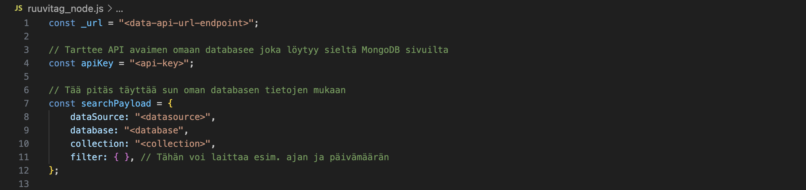
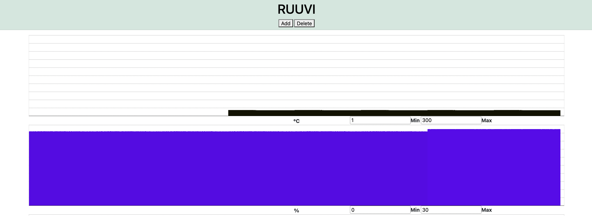

# Metropolia UAS's "UrbanFarmLab"

The UrbanFarmLab is a project designed to collect and visualize sensor data from RuuviTags. This repository contains code for collecting data from RuuviTags, storing it in a MongoDB database, and displaying it in a web interface.

## Requirements

**To run the project, you need to have Python 3.10 or a newer version installed. Additionally, you need to install the following Python packages:**

- `ruuvitag-sensor`
- `requests`

**You need to install these packages using pip/pip3:**

```bash
python3 -m pip install ruuvitag-sensor
pip3 install requests
```
OR
```bash
python -m pip install ruuvitag-sensor
pip install requests
```

**You need to install MongoDB into your terminal for ruuvitag_node.js:**

```bash
npm install mongodb
```

## Getting Started

1. **Clone this repository to your local machine:**

```bash
git clone https://github.com/your-username/urbanfarmlab.git
```

2. **Navigate to the project directory:**

```bash
cd urbanfarmlab
```

3. **Set up MongoDB with your project:**
  
   This project requires a connection to your own MongoDB database. Here's a step-by-step guide on setting it up:

   i. Create a new project in MongoDB for your database. Click on "New Project" and name it anything you'd like. Click on "Next", then "Create Project".
   
   ii. In the left "Overview" section, create a cluster by clicking on "Create". Deploy your cluster by selecting a server plan. The **M0** plan is completely free and used for learning and exploring MongoDB in a cloud environment. This is what you'd typically select. Name your cluster, select your desired provider and region. Click "Create Deployment" to deploy your cluster.

   iii. Add your connection IP address, create your database user and then click "Create Database User". Click "Choose a connection method" to proceed.

   iv. To connect your cluster, go to the "Connect to your application" section and select "Drivers" to follow further instructions. Add your Driver and your version, and install. Run the following code in your command line.

   ```bash
   npm install mongodb
   ```

   v. Once completed and installed, in the left "Deployment" section, click on "Database". You should find your cluster that you have created. Click on "Browse Collections", then create your own data by clicking "Add My Own Data". Then, name your database and collection.

   After creating the connection to your database, we have to create an API key which is to be implemented into `ruuvitag_node.js` and `ruuvitag_haku.py`:

   vi. In the left "Services" section, click on "Data API". Select your cluster as the data source you would like to enable the API on, and click "Enable Data Access from the Data API".

   vii. In the pop-up "Create Your Data API Key", create your Data API Key by giving it a name, and clicking on "Generate API Key".

   viii. Copy your API key and add it into the API Key sections in the files `ruuvitag_node.js` and `ruuvitag_haku.py`:

   `ruuvitag_node.js`:

   
   
   `ruuvitag_haku.py`:

   

   ix. In the "Copy snippet into your code" section, select your database and collection name to ensure that your database/script works properly.

   x. Once added the API key to both of the files, fill in the information in the searchPayload section (`ruuvitag_node.js`) and in the insertPayload section (`ruuvitag_haku.py`). **dataSource** would be your cluster name, **database** would be your database, and **collection** would be your collection. If you're on your cluster, go to "Collections" and you'll find your cluster name, database and collection name.

   After creating the API key, we have to create a Data API URL Endpoint which is to be implemented into `ruuvitag_node.js` and `ruuvitag_haku.py`:

   xi. In the left "Services" section, click on Data API, go to Settings, from there search for "View Advanced Settings" and click on it.

   xii. Click "Continue to App Services". This will redirect you to a new tab where you'll click "HTTP Endpoints" in the "Custom HTTP Endpoints" section.

   xiii. Click "Add an Endpoint", in "Route", add the name "action/findOne". Repeat this step with one more endpoint with the "Route" name as "action/insertOne".

   xiv. In both of these endpoints, in the "Function" section, add the function "resetFunc" for both of them. Make sure to save after making these changes.

   xv. For both of these endpoints, in the "Endpoint Settings" section, in "Operation Type", copy the "findOne" endpoint and add it into the `ruuvitag_node.js` file. Repeat this same step with the "insertOne" endpoint, but add it into the `ruuvitag_haku.py` file:

   `ruuvitag_node.js`:

   
   
   `ruuvitag_haku.py`:

   

   Endpoints examples:

   `ruuvitag_node.js`: https://eu-central-1.aws.data.mongodb-api.com/app/your-data/endpoint/action/findOne

   `ruuvitag_haku.py`: https://eu-central-1.aws.data.mongodb-api.com/app/your-data/endpoint/action/insertOne

   Add the endpoints to the Data API URL Endpoint sections in these files.

   Covering all these steps, you have now established the connection to your MongoDB database. 

   
5. **Run the Python script to collect sensor data:**

```bash
python3 ruuvitag_haku.py
```

5. **Run the Node.js script to fetch data from the MongoDB database:**

```bash
node ruuvitag_node.js
```

6. **Open the `ruuvitag_website.html` file in your web browser to view the sensor data visualization.**


## Tasks

1. **Add x-axis values and y-axis values to each graph. This is done in `ruuvitag_website.html` and `jsonInput.js`. You can decide what values to add in the x and y axises.**

   This is how the current graphs looks like, there aren't any x-axis values and y-axis values to understand the graph's data.

   

   This is how the graph should look like, the x-axis values and y-axis values should be added based off of the RuuviTag data. In this graph, the example values of the axises are time (x-axis) and amount of value. (y-axis)

   

3. **Upgrade the front end with proper responsiveness and enhanced UI design.**

    To make changes to the website's front end appearance, you would primarily modify the following files:
    
     - `ruuvitag_website.html`: This file contains the HTML structure of the website. You can modify the layout, add new elements, or change existing ones to customize the appearance of the front end.
       
     - `jsonInput.js`: This JavaScript file dynamically creates the bar graphs based on the data fetched from the data.json file. You can modify this file to change how the charts are displayed or to add new visualizations.
  
     Use Urban&Local's theme for the website's UI design: [Urban&Local's Design Theme](https://github.com/satvikvelpula/UrbanFarmLab/blob/main/Urban%26Local%20Theme.pptx)

4. **Change the graphing style of data displayed on the charts. Bar graphs aren't the best way to display data, a more optimal graphing style would be an area chart:**

   <p align="center"></p>
   
    To change the graphing style from bar graphs to area charts, you'll primarily modify the code responsible for rendering the charts in the front end:
    
     - `ruuvitag_website.html`: Update the HTML structure to include elements for displaying area charts instead of bar graphs. You may need to adjust the layout and add necessary containers for the area charts.
       
     - `jsonInput.js`: Adjust the JavaScript code that generates the charts to render area charts instead of bar graphs. You'll need to use a JavaScript charting library that supports area charts, such as Chart.js, D3.js or Plotly.js. Update the logic to create and customize area charts based on the fetched data.
  
     - **CSS Styling (Optional)**: Depending on the charting library used and your design preferences, you may need to apply custom CSS styles to the area charts to achieve the desired appearance. This can include adjusting colors, fonts, and other visual aspects of the charts.

## Credits

README.md file created by **Satvik Velpula** and **Than Ngoc Quang**

Website Developers: **Ramin Ahmadi**, **Mikael Kalle Johannes Nyman**, **Tiitus Heikki**, **Juhani Merikallio**, **Satvik Velpula**, **Than Ngoc Quang** and **Mikhail Kryukov**
